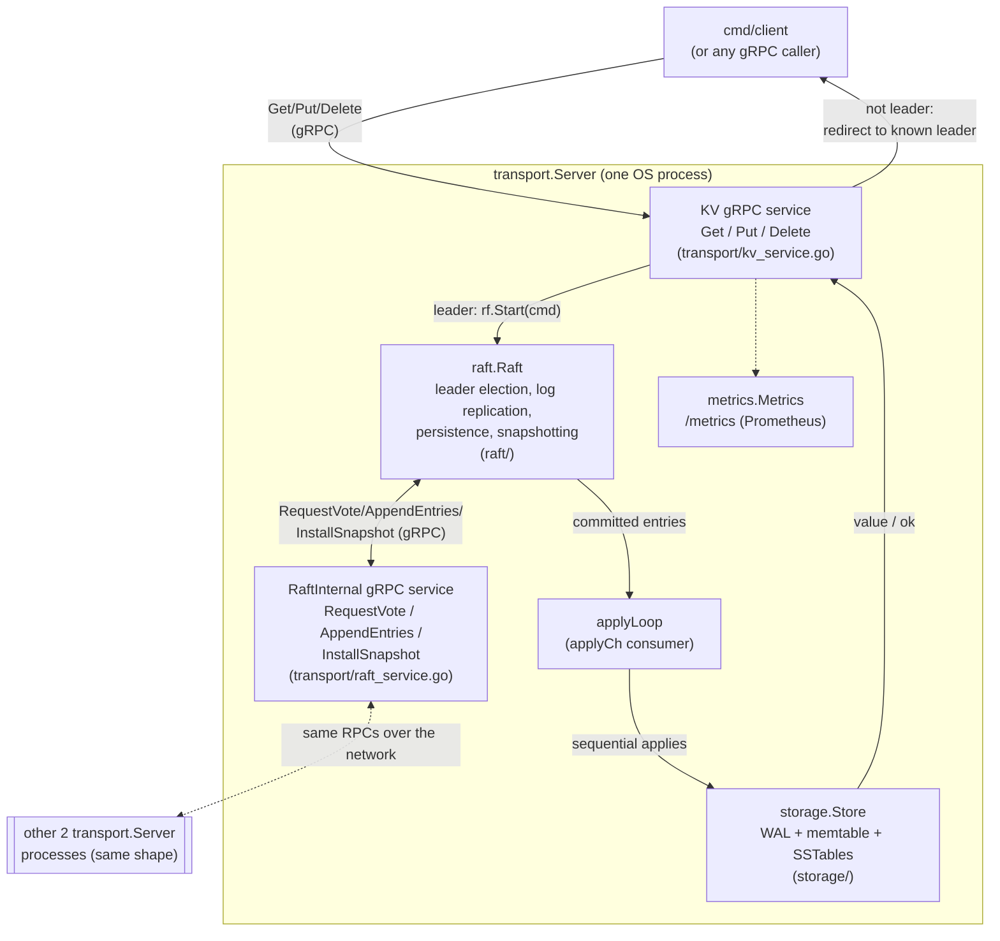

# mini-kv (RaftKV)

A distributed, fault-tolerant key-value store written in Go — a
from-scratch Raft consensus implementation on top of an LSM-style storage engine. This is a personal project.

## Project layout

```
mini-kv/
├── engine/        # in-memory KV engine
├── storage/       # WAL + LSM
├── raft/          # Raft consensus
├── transport/     # gRPC service wrapping raft/storage
├── metrics/       # Prometheus collectors, one private registry per node
├── cmd/
│   ├── server/         # server process: flags -peers/-me/-dir/-metrics-addr
│   ├── client/         # client CLI: get/put/delete against a cluster
│   ├── clusterstatus/  # probes every peer's leader/follower state
│   ├── enginecli/      # manual debug REPL for engine.Engine
│   ├── storagecli/     # manual debug REPL for storage.Store
│   ├── loadgen/        # real p50/p99/throughput load generator
│   └── wabench/        # real storage write-amplification measurement
├── scripts/
│   └── fault_tolerance_demo.sh # kill-leader + isolate-node demo
└── simharness/    # MIT 6.824/6.5840-style test rig (fake network, fake
                   # persister, N-peer config) — its own Go module, used
                   # via go.work, its go.mod is not modified
```

## Modules

- **Engine** — `engine.Engine` is a minimal `Get/Put/Delete`
  interface with explicit copy semantics. Five implementations
  (`MutexMap`, `ShardedMap`, `RWMutexMap`, `SyncMap`, `RCUShardedMap`)
  compare different concurrency-control strategies over the same
  interface.
- **Storage** — `storage.Store` is a durable, LSM-style key-value
  engine: a group-commit WAL, a skip-list memtable, immutable checksummed
  SSTables, an append-only manifest, and background size-tiered
  compaction.
- **Raft** — a from-scratch Raft implementation covering leader
  election, log replication with the Figure 2 conflict-backtracking
  optimization, persistence, and snapshot/log compaction with
  `InstallSnapshot`. Tested through `simharness`, an in-process fake
  network/persister test rig.
- **Transport** — wires `raft.Raft` and `storage.Store` into a real
  multi-process cluster over gRPC (`raftkvpb/`), with leader redirect on
  the client side. Peer membership is static, set at startup via `-peers`.
  Known gap: Raft's own persistent state still uses the in-memory
  `simharness` persister, so it does not survive a real process restart —
  only `storage.Store`'s data is durable across restarts today.
- **Fault tolerance** — `transport/server_test.go` has two
  fault-injection tests: killing the leader mid-write, and isolating one
  follower via `transport.Server.SetPartitioned`, a network-partition
  simulation built entirely at the application layer (no root/iptables
  needed): it disables that node's own outbound Raft RPC ends and makes
  its inbound RaftInternal handlers refuse, in both directions, while its
  election/heartbeat ticker keeps running underneath.
  `scripts/fault_tolerance_demo.sh` runs both scenarios against three real
  `cmd/server` processes over real loopback gRPC and prints a transcript
  proving the cluster elects a new leader and keeps accepting writes, and
  that an isolated minority-of-one never declares itself leader.
- **Observability** — each node serves its own Prometheus metrics at
  `-metrics-addr` (default `localhost:9101+me`) `/metrics`: a
  `raftkv_request_duration_seconds` histogram and a
  `raftkv_requests_total{op,result}` counter for every Get/Put/Delete
  (`result` is `ok`, `not_leader`, or `error` — enough for p50/p99
  latency, throughput, and error rate via PromQL), plus a `raftkv_keys`
  gauge for the number of live keys currently stored. `metrics.Metrics`
  registers on a private `prometheus.Registry` per node rather than the
  global one, so multiple `transport.Server`s can coexist in one process
  (as the in-process test clusters in `transport/server_test.go` do)
  without colliding. Logging across `cmd/server` and `transport/` uses
  structured `log/slog`, tagged with the node index.
- **Benchmarks** — `cmd/loadgen` is a real load generator: N
  concurrent simulated clients, each its own `transport.Client`, driving
  a real cluster over gRPC and reporting real p50/p90/p99 latency and
  throughput. `cmd/wabench` measures `storage.Store`'s real write
  amplification (physical bytes written, from `/proc/self/io`, divided by
  logical bytes the caller asked to write) across a range of value sizes.
  Running `cmd/loadgen` against a real 1-node cluster for the "1-node
  vs 3-node" comparison surfaced two real bugs in `raft/raft.go`, both
  now fixed: `startElection`'s `RequestVote` fan-out loop skips `rf.me`,
  so with a single peer it runs zero times and the majority check that
  normally lives inside each vote reply's handler never ran, even though
  a lone self-vote is already a majority of one; and even after fixing
  that, `advanceCommitIndex` (the only thing that ever advances
  `commitIndex`) was only ever called from a `replicateTo` reply handler,
  which also never fires with zero peers to reply — so a 1-node leader
  got elected but then hung forever on every write. Both fixes are exact
  no-ops for N>1 (verified with `go test ./raft/... -race -count=3` and
  the full suite, no regressions). All real numbers below came from a
  real run, not an estimate.

## Architecture

One node, showing every layer a request crosses. All three nodes run the
identical binary (`cmd/server`); which one is "the leader" changes at
runtime via Raft election, not at deploy time.



**Request flow for a `Put`** (the path measured in
[Benchmarks](#benchmarks)):

1. Client sends `Put` over gRPC to whichever node it's configured with.
2. If that node isn't the Raft leader, it rejects with the last known
   leader's address (`transport/kv_service.go`); the client retries there.
3. The leader calls `raft.Raft.Start`, which appends the command to its
   local log and returns immediately — it does not block for
   replication.
4. `raft.Raft` replicates the entry to followers via `AppendEntries`
   RPCs (`raft/rpc.go` client side, `transport/raft_service.go` +
   `raft_forwarder.go` server side); once a majority (including the
   leader) has durably persisted it, the leader advances `commitIndex`.
5. The committed entry is delivered on `applyCh`; the server's
   `applyLoop` (`transport/server.go`) applies it to `storage.Store` in
   log order — this is the single-goroutine, one-fsync-per-write
   serialization point identified as the throughput ceiling in the
   benchmarks below.
6. The original RPC handler, which has been waiting on that log index,
   returns the result to the client.

A `Get` skips steps 3–4 today (read-through-leader, no lease reads — see
[Transport](#modules)), which is why its measured latency is much
lower than `Put`'s.

## Build, test, run

```bash
go build ./...
go vet ./...
go test ./... -race
```

Run a local 3-node cluster (three terminals):

```bash
go run ./cmd/server -me=0
go run ./cmd/server -me=1
go run ./cmd/server -me=2
```

```bash
go run ./cmd/client
> put hello world
OK
> get hello
"world"
```

Scrape a node's metrics (node 0's default `-metrics-addr` is
`localhost:9101`):

```bash
curl localhost:9101/metrics
```

Watch fault tolerance in action — kill the leader mid-write, isolate a
node, and confirm the cluster keeps working — against three real
processes (no manual setup needed, the script starts and tears down its
own clusters):

```bash
scripts/fault_tolerance_demo.sh
```

## Benchmarks

All numbers below came from a real run, not an estimate. Machine: Intel
Core i7-11700 @ 2.50GHz (8C/16T), 31GiB RAM, NVMe/ext4 disk (not tmpfs —
fsync cost is the whole point of the write-amplification numbers below,
so it has to hit a real disk), Linux 7.1.8.

```bash
go run ./cmd/loadgen -peers=localhost:9001,localhost:9002,localhost:9003 -clients=50 -duration=15s
go run ./cmd/wabench -valuesize=4096
```

**Sharded vs single-mutex** (`go test ./engine/... -bench=. -benchmem -keyspace=100000 -valuesize=256 -writepct=50 -cpu=1,4,16`):

| Engine | 1 CPU | 4 CPU | 16 CPU |
|---|---|---|---|
| MutexMap | 162 ns/op | 168 ns/op | 220 ns/op |
| ShardedMap | 172 ns/op | 63.8 ns/op | **35.3 ns/op (6.2× MutexMap)** |
| SyncMap | 309 ns/op | 83.9 ns/op | 51.5 ns/op |
| RWMutexMap | 190 ns/op | 229 ns/op | 237 ns/op |
| RCUShardedMap | 8843 ns/op | 2102 ns/op | 1214 ns/op |

MutexMap gets *slower* under more CPUs (single-mutex contention, 50%
writes); ShardedMap scales near-linearly.

**1-node vs 3-node**, real gRPC cluster, 50 concurrent clients, 15s,
10k-key keyspace, 128B values, 50% Put/50% Get:

| Cluster | Throughput | p50 | p90 | p99 |
|---|---|---|---|---|
| 1 node | 605 ops/s | 26.8 ms | 197 ms | 239 ms |
| 3 node | 480 ops/s | 114 ms | 238 ms | 281 ms |

Single-client (uncontended) latency floor: 1 node p50 4.2ms, 3 node p50
8.3ms. The gap between that floor and the 50-client p50 is queueing
delay in front of `transport.Server.applyLoop`'s single-goroutine,
one-fsync-per-write apply path (confirmed via the leader's own
`raftkv_request_duration_seconds` metric in the same run: Put averaged
139ms, Get — which skips the log entirely — averaged 7.4ms), not Raft's
own RPC round trip: the single-client floor already goes through the
same replication path and stays under 10ms. Not fixed here
(measure and report, not optimize) — the natural fix would be batching
several already-committed entries into one write/fsync in `applyLoop`
(group commit at the apply layer, not just inside `WAL.Append` as today),
not attempted here for lack of evidence it's needed at this project's
scale.

**Write amplification vs value size** (`cmd/wabench`, 20k Puts over a
1k-key keyspace — each key overwritten ~20×, 256KiB flush threshold):

| Value size | Write amplification |
|---|---|
| 64 B | 58.9× |
| 1 KiB | 6.68× |
| 4 KiB | 4.72× |
| 16 KiB | 5.00× |

Amplification does **not** increase with value size — the trigger
condition for value separation (WiscKey/Badger-style) is not met by real
measurement, so it stays out of scope.
